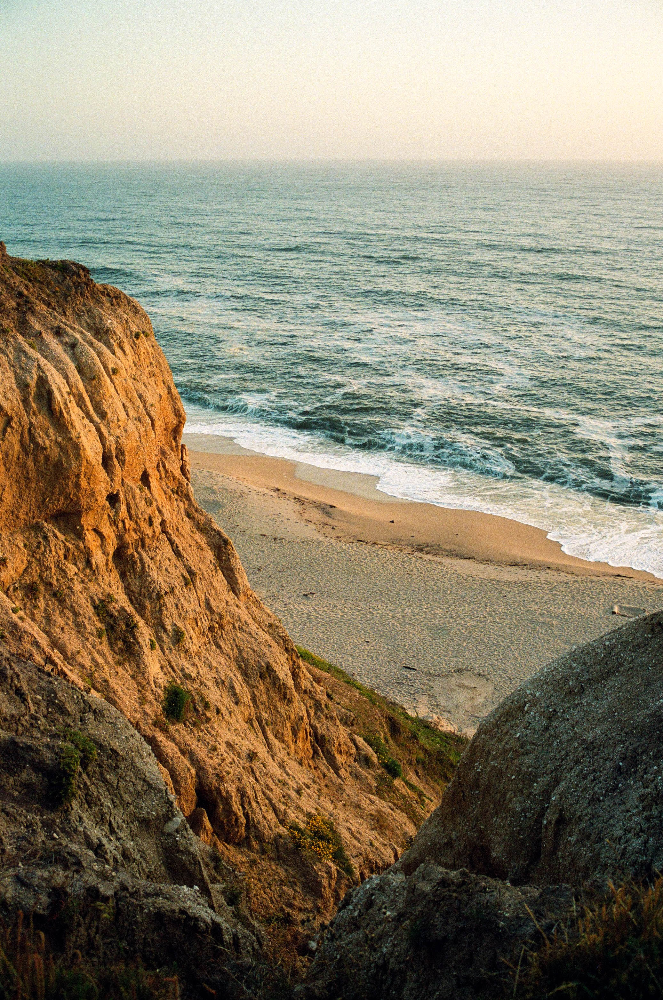

# 🎨 Shengjie Film - Sustainable Workflow Guide

## **📋 How to Add New Content Sustainably**

This guide ensures your website maintains its lightning-fast performance when you add new photos or travel destinations.

---

## **📸 Adding New Portfolio Photos**

### **Step 1: Add Your Images**
```bash
# Add your new photos to the images/ folder
# Example: images/20.jpg, images/21.jpg, etc.
```

### **Step 2: Optimize Images**
```bash
# Run the automated optimization script
./optimize-images.sh
```

### **Step 3: Update HTML**
Add new photos to `index.html` in the portfolio section:

```html
<!-- Photo 20 -->
<div class="aspect-[4/5] overflow-hidden cursor-pointer" onclick="openModal('images/optimized/20.jpg')">
  
</div>
```

### **Step 4: Update Preloading (Optional)**
If the new photo is important for first impression, add to `<head>`:
```html
<link rel="preload" href="images/optimized/20.jpg" as="image" type="image/jpeg">
```

---

## **✈️ Adding New Travel Destinations**

### **Step 1: Create Folder Structure**
```bash
# Create new destination folder
mkdir "images/New Destination"
# Add photos to the folder
# Example: images/New Destination/1.jpg, images/New Destination/2.jpg, etc.
```

### **Step 2: Optimize Images**
```bash
# Run the automated optimization script
./optimize-images.sh
```

### **Step 3: Create Destination Page**
Create `new-destination.html` (copy from existing template):

```html
<!DOCTYPE html>
<html lang="en">
<head>
    <meta charset="UTF-8" />
    <meta name="viewport" content="width=device-width, initial-scale=1.0" />
    <title>New Destination — Shengjie Film</title>
    <meta name="description" content="Film photography from New Destination by Shengjie" />
    <link rel="icon" href="logo.png" type="image/png" sizes="32x32" />
    <link rel="icon" href="logo.png" type="image/png" sizes="16x16" />
    
    <!-- Preload critical resources -->
    <link rel="preload" href="logo.png" as="image" type="image/png">
    <link rel="preload" href="images/optimized/New Destination/1.jpg" as="image" type="image/jpeg">
    
    <script src="https://cdn.tailwindcss.com"></script>
    <link rel="preconnect" href="https://fonts.googleapis.com">
    <link rel="preconnect" href="https://fonts.gstatic.com" crossorigin>
    <link href="https://fonts.googleapis.com/css2?family=Inter:wght@300;400;500;600;700&display=swap" rel="stylesheet" media="print" onload="this.media='all'">
    <noscript><link href="https://fonts.googleapis.com/css2?family=Inter:wght@300;400;500;600;700&display=swap" rel="stylesheet"></noscript>
    
    <!-- Copy the same CSS styles from index.html -->
    <style>
        /* Copy all CSS from index.html */
    </style>
</head>
<body class="bg-white text-gray-900 font-light leading-relaxed">
    <!-- Copy header structure from index.html -->
    
    <!-- Main content -->
    <main class="pt-20 pb-16">
        <div class="max-w-7xl mx-auto px-6">
            <a href="index.html#travel" class="inline-flex items-center text-sm text-muted hover:text-gray-900 transition-colors duration-200 mb-8" onclick="showTravelTab()">
                <svg class="w-4 h-4 mr-2" fill="none" stroke="currentColor" viewBox="0 0 24 24">
                    <path stroke-linecap="round" stroke-linejoin="round" stroke-width="2" d="M15 19l-7-7 7-7"></path>
                </svg>
                Back to Travel
            </a>
            
            <h1 class="text-4xl md:text-5xl font-light text-gray-900 mb-12">New Destination</h1>
            
            <!-- Photo grid -->
            <div class="grid grid-cols-2 md:grid-cols-3 lg:grid-cols-4 gap-4 md:gap-6">
                <!-- Add all photos from the destination -->
                <div class="aspect-[4/5] overflow-hidden cursor-pointer" onclick="openModal('images/optimized/New Destination/1.jpg')">
                    
                </div>
                <!-- Add more photos... -->
            </div>
        </div>
    </main>
    
    <!-- Copy modal structure and JavaScript from index.html -->
    
    <script>
        // Copy optimized JavaScript from index.html
    </script>
</body>
</html>
```

### **Step 4: Update Travel Tab**
Add the new destination to `index.html` travel section:

```html
<a href="new-destination.html" class="group">
    <div class="aspect-[4/5] overflow-hidden">
        
    </div>
    <h3 class="text-lg font-medium text-gray-900 mt-4 group-hover:text-muted transition-colors duration-200">New Destination</h3>
</a>
```

---

## **🔧 Automated Tools**

### **Image Optimization Script**
```bash
# Run this after adding any new images
./optimize-images.sh
```

**What it does:**
- ✅ Automatically optimizes all new images
- ✅ Only processes new/changed images (saves time)
- ✅ Shows optimization results and file size savings
- ✅ Creates optimized versions in `images/optimized/`

### **Quick HTML Updates**
For adding lazy loading to new images:
```bash
# Add lazy loading to all images in a file
sed -i '' 's|class="w-full h-full object-cover hover:scale-105 transition-transform duration-300"|class="w-full h-full object-cover hover:scale-105 transition-transform duration-300" loading="lazy"|g' your-file.html
```

---

## **📊 Performance Checklist**

Before deploying, ensure:

### **✅ Image Optimization**
- [ ] All images are in `images/optimized/` folders
- [ ] All images have `loading="lazy"` attribute
- [ ] Critical images (first 10 portfolio) have preload tags

### **✅ Code Quality**
- [ ] All image paths use `images/optimized/` instead of `images/`
- [ ] JavaScript functions work with new content
- [ ] Mobile menu includes new pages

### **✅ Testing**
- [ ] Test on desktop and mobile
- [ ] Verify modal/lightbox works with new images
- [ ] Check navigation between pages
- [ ] Test external links (Prints tab)

---

## **🚀 Deployment Workflow**

```bash
# 1. Add new content
# 2. Optimize images
./optimize-images.sh

# 3. Test locally
# 4. Commit changes
git add .
git commit -m "Add new content: [description]"

# 5. Deploy
git push origin main
```

---

## **💡 Pro Tips**

### **Image Naming Convention**
- **Portfolio**: Use numbers (1.jpg, 2.jpg, etc.)
- **Travel**: Use `1.jpg` for cover photo, then random order
- **File names**: Keep them simple and descriptive

### **Performance Best Practices**
- **Cover photos**: Always use `1.jpg` for consistency
- **Preloading**: Only preload the most important images
- **Lazy loading**: Always add to new images
- **File sizes**: Keep original images for backup, use optimized for web

### **Maintenance**
- **Monthly**: Run optimization script to catch any missed images
- **Quarterly**: Review and update preload tags for new critical images
- **Annually**: Audit overall performance and consider new optimizations

---

## **🎯 Success Metrics**

Your website should maintain:
- **Loading speed**: Under 3 seconds on mobile
- **Image optimization**: 90%+ file size reduction
- **User experience**: Smooth navigation and interactions
- **SEO performance**: Fast loading times for search engines

---

**🎨 Your website is now set up for sustainable growth with professional performance!**
